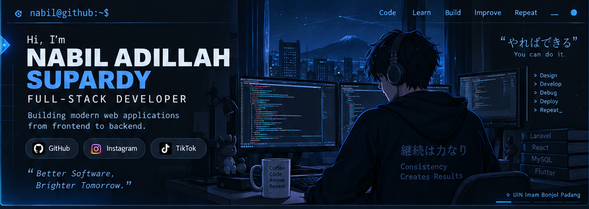
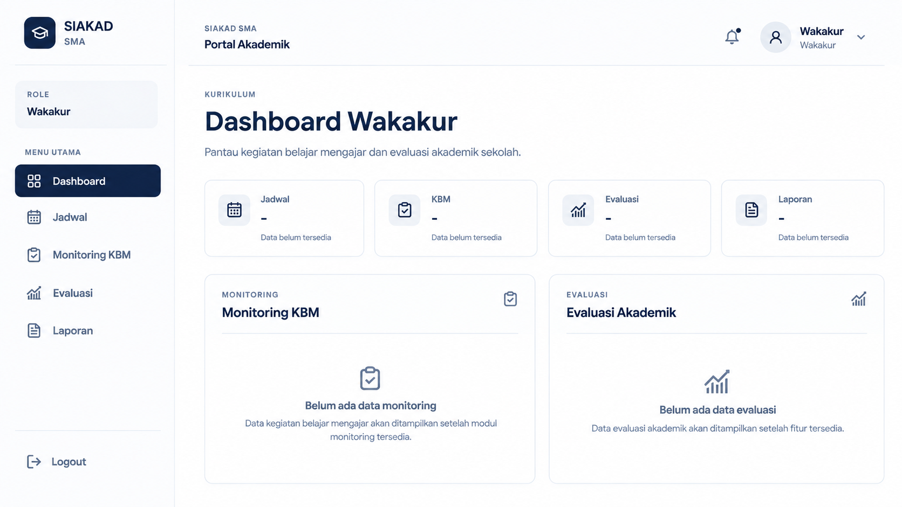
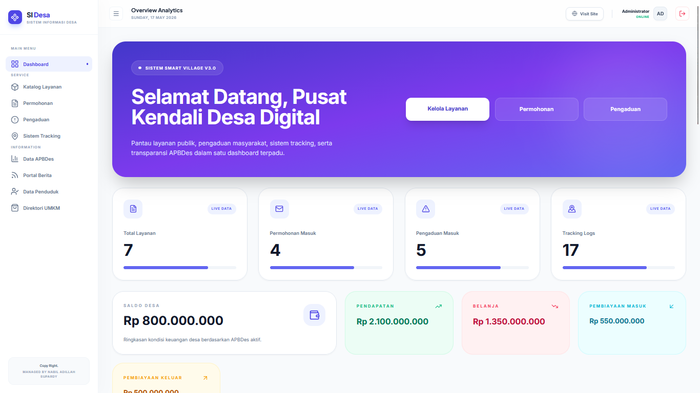

<p align="center">
  
</p>

<h1 align="center">Nabil Adillah Supardy</h1>

<p align="center">
  <strong>Full-Stack Developer</strong>
</p>

<p align="center">
  Building modern web applications from frontend to backend.
</p>

<p align="center">
  <a href="https://github.com/nabilsupardy4422">
    
  </a>
  <a href="https://www.instagram.com/nabilsupardy/">
    
  </a>
  <a href="https://www.tiktok.com/@nabil.supardy">
    
  </a>
</p>

---

## About Me

I am a university student and Full-Stack Developer focused on building practical web applications, REST APIs, and data-driven systems.

I enjoy learning by building real projects, understanding how each layer works, and improving the implementation over time.

```text
nabil@github:~$ whoami

Nabil Adillah Supardy

nabil@github:~$ role

Full-Stack Developer

nabil@github:~$ focus

Web Development
REST API
Database-driven Applications
Mobile Development

nabil@github:~$ currently_building

SIAKAD SMA

nabil@github:~$ motto

Build it. Understand it. Improve it.
```

---

## Tech Stack

### Frontend

<p>
  
</p>

### Backend

<p>
  
</p>

### Database

<p>
  
</p>

### Mobile

<p>
  
</p>

### Tools

<p>
  
</p>

---

## Featured Projects

<table>
<tr>
<td width="50%" valign="top">

### SIAKAD SMA

<p align="center">
  
</p>

**Academic Management System**

Sistem informasi akademik berbasis web untuk mendukung pengelolaan jadwal, absensi, penilaian, monitoring KBM, dan akses berdasarkan role pengguna.

**Core Stack**

`React` `Vite` `Tailwind CSS`  
`Laravel 13` `REST API` `Sanctum` `MySQL`

<p>
  
</p>

<a href="https://github.com/nabilsupardy4422/siakad_sma">
  <b>View Project →</b>
</a>

</td>

<td width="50%" valign="top">

### Sistem Informasi Desa

<p align="center">
  
</p>

**Digital Village Information System**

Sistem informasi desa berbasis Laravel yang dikembangkan untuk mendukung digitalisasi informasi dan pelayanan publik serta pengelolaan data desa.

**Core Stack**

`Laravel 12` `PHP` `MySQL`  
`Blade` `Tailwind CSS` `Chart.js` `Vite`

<p>
  
</p>

<a href="https://github.com/nabilsupardy4422/sistem-informasi-desa">
  <b>View Project →</b>
</a>

</td>
</tr>
</table>

---

<h2>📊 Coding Activity</h2>

<p align="center">
  
</p>

---

<h2>GitHub Statistics</h2>

<p align="center">
  
  
</p>

---

## Current Focus

<table>
<tr>
<td width="33%" align="center">

### Full-Stack Development

Building complete web applications across frontend, backend, and database layers.

</td>
<td width="33%" align="center">

### REST API Development

Designing structured APIs for reliable frontend-backend integration.

</td>
<td width="33%" align="center">

### Database-driven Apps

Working with relational databases and application data architecture.

</td>
</tr>

<tr>
<td width="33%" align="center">

### Authentication & Authorization

Implementing secure authentication and role-based access control.

</td>
<td width="33%" align="center">

### Mobile Development

Exploring practical mobile application development and API integration.

</td>
<td width="33%" align="center">

### Software Architecture

Designing maintainable application structures and modular systems.

</td>
</tr>
</table>
---

## Development Philosophy

> Build with purpose.  
> Keep it simple.  
> Make it maintainable.

I focus on understanding the problem before writing the solution. Good software is not only about making features work, but also about building systems that are structured, understandable, and practical to maintain.

My approach:

- Understand the problem
- Design the system
- Build incrementally
- Test and refine
- Keep improving
---

## Let's Build Something

<p align="center">
  <b>Have an idea, project, or problem to solve?</b><br>
  Let's turn it into a working solution.
</p>

<p align="center">
  <a href="https://github.com/nabilsupardy4422">
    
  </a>
  <a href="https://www.instagram.com/nabilsupardy">
    
  </a>
  <a href="https://www.tiktok.com/@nabil.supardy">
    
  </a>
</p>

<p align="center">
  <sub>Better Software, Brighter Tomorrow.</sub>
</p>
---

<p align="center">
  Built with care by <strong>Nabil Adillah Supardy</strong>
</p>
